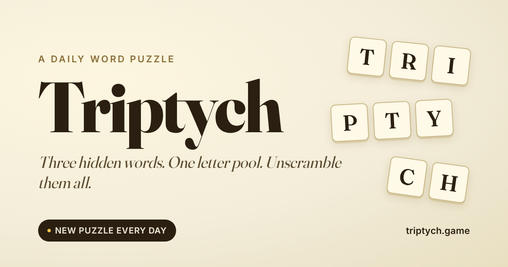

# Triptych

**A small daily word puzzle in three parts.**

Three hidden words share a single letter pool. Unscramble them all — five attempts, one new puzzle every day at midnight Pacific.



## Play

- **Live demo:** _(add your deploy URL here)_
- **Daily mode:** New puzzle every day. Locked board, shareable result.
- **Free play:** Beginner / Normal / Hard / Expert difficulty.
- **Custom:** Bring your own three words.

## Features

- Daily puzzle with Pacific-midnight rollover and live countdown
- Wordle-style shareable result (emoji grid, attempts, time, streak)
- Persistent stats and streaks via `localStorage`
- Installable as a PWA — works offline after first load
- Beginner mode with progressive hints (rhyme → first letter → full row reveal)
- Hash-seeded daily puzzles so every player gets the same board
- No build step. No framework install. React 18 + Babel standalone from CDN.

## Run locally

No build tools required.

```bash
git clone https://github.com/justinsteu/triptych.git
cd triptych
python3 -m http.server 8000
# open http://localhost:8000
```

Any static server works — `npx serve`, `php -S`, etc.

## Deploy

### One-click to Netlify

[](https://app.netlify.com/start/deploy?repository=https://github.com/justinsteu/triptych)

### Manual

The whole project is static. Drop the folder onto any host:

- **Netlify:** drag the folder into [app.netlify.com/drop](https://app.netlify.com/drop)
- **Vercel:** `vercel --prod`
- **GitHub Pages:** push to `main`, enable Pages in repo settings
- **Cloudflare Pages:** connect the GitHub repo, leave build command empty, publish directory `/`

### Push to GitHub

```bash
git init
git add -A
git commit -m "Triptych v1.0"
git branch -M main
git remote add origin https://github.com/justinsteu/triptych.git
git push -u origin main
```

## Project structure

```
triptych/
├── index.html          # entry, meta tags, font + script loaders
├── app.jsx             # entire React app (single file, Babel standalone)
├── styles.css          # all styles
├── sw.js               # service worker (offline cache)
├── manifest.json       # PWA manifest
├── og-card.png         # 1200x630 social share image
├── og-template.html    # source for the OG card
├── netlify.toml        # static publish config + security headers
└── icon-*.png          # PWA icons
```

## How daily puzzles work

Each day's puzzle is deterministic: `mulberry32(hash(YYYY-MM-DD))` seeds the puzzle selection, so every player worldwide gets the same three words. Rollover happens at midnight America/Los_Angeles. The browser computes the date locally — no server needed.

## Credits

- Type: [Fraunces](https://fonts.google.com/specimen/Fraunces) and [Inter](https://fonts.google.com/specimen/Inter)
- Word lists: curated by hand
- Built with [Perplexity Comet](https://perplexity.ai)

## License

MIT
